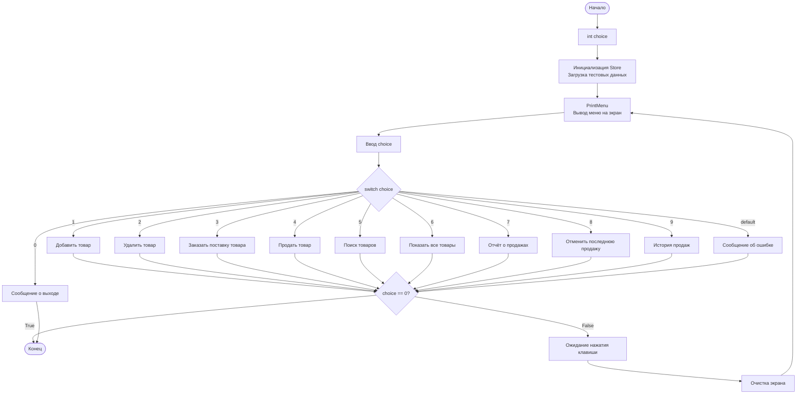

# Блок-схема практической работы №9
## Система управления магазином

## Описание блок-схемы

### Основные блоки:

1. **Начало** - точка входа в программу
2. **Объявление переменной** - `int choice` для хранения выбора пользователя
3. **Инициализация** - создание объекта Store и загрузка тестовых данных
4. **PrintMenu** - вывод главного меню на экран
5. **Ввод choice** - получение выбора пользователя
6. **switch (choice)** - проверка выбора пользователя

### Операции меню:

- **1** - Добавить товар
- **2** - Удалить товар  
- **3** - Заказать поставку товара
- **4** - Продать товар
- **5** - Поиск товаров
- **6** - Показать все товары
- **7** - Отчёт о продажах
- **8** - Отменить последнюю продажу
- **9** - История продаж
- **0** - Выход
- **default** - Сообщение об ошибке

### Цикл работы:

После выполнения операции (кроме выхода):
1. Проверка условия `choice == 0`
2. Если `False` - ожидание нажатия клавиши, очистка экрана, возврат к меню
3. Если `True` - завершение программы

